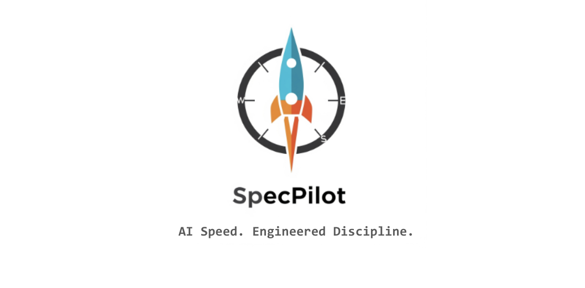

# SpecPilot: AI-Powered Spec-Driven Development Framework

<div style="width: 100%; text-align: center; background-color: white;">
  
</div>

## Overview

Let's face it. Vibe coding with AI is slow. Discipline and Rigor is required for speed. SpecPilot is your solution. AI Speed. Engineered Discipline.

SpecPilot is an opinionated, AI-powered development framework that transforms how you build software by enforcing a rigorous spec-driven development methodology. It's designed to work seamlessly with Cursor IDE to provide a structured, collaborative development experience that prioritizes architecture, documentation, and systematic implementation.

With SpecPilot you are 100% in control of your Project Conventions, Product Requirements, Product Roadmap, Architecture, Technical Roadmap and Implementation.

SpecPilot uses a prompt and file conventions to guide your Cursors agent through consistent verification and validation of every step of the development process to make sure when AI is coding it knows what it is doing and your documentation, project conventions and architecture are always aligned.

## HELPFUL CONTEXT : Some Notes about Spec Pilot and the Author

I built this project in a weekend while building some software as a gift for my daughter. Vibe coding is just slow. This is much faster because the vibes are contained.

My Environment

- Cursor (Typically with Cloud)
- Gemini for assistance.

The environment I find works best is to use Gemini or an AI Chat Bot in a browser and do some planning and prompt development there. I then paste the prompts into cursor for further refinement or for execution. I am constantly going back and forth between the tools. Refining prompts and getting cursor to do the right thing. A few key points.

- You have to be disciplined and update your project conventions, architecture and perhaps your spec diven prompt overridde to keep cursor in line.
- When Cursor and Cloude fail I often paste issues and context into Gemini directly for help.
- I would use Gemini in Cursor but the calls fail often for me.
- This tool I developed makes me 10 times faster and keeps everything neat, clean and maintainable. AI can generate lots of code and i find without disciplien it creates lots of bad code.

Enjoy..

## What SpecPilot Does

SpecPilot is a comprehensive development workflow engine that:

### 🎯 **Enforces Spec-Driven Development**

- **Documentation First**: Every feature must be specified in `.md` files before implementation
- **Golden Thread**: Maintains traceability from specs → source code → tests across the entire project
- **Architecture Validation**: Continuously validates implementation against architectural specifications
- **Systematic Implementation**: Breaks development into discrete, verifiable steps

### 🤖 **Provides AI-Powered Development Modes**

SpecPilot operates through 10 specialized modes, each with specific protocols:

1. **🚦 Initialization Mode**: Project startup with comprehensive validation
2. **🤖 Autonomous Mode**: Executes roadmap tasks systematically
3. **🚀 Bootstrap Mode**: Creates new projects with full structure
4. **🏛️ Architecture Mode**: Collaborative architectural design and validation
5. **🎨 Design Mode**: Creates specification documents
6. **📐 Spec Mode**: Implements code based on specifications
7. **🍄 Vibe Mode**: Debugging and troubleshooting
8. **🕵️ Deep Check Mode**: Comprehensive project auditing
9. **🛠️ Scripts Mode**: Utility script management
10. **🎁 Commit Mode**: Intelligent commit analysis and generation

### 📊 **Intelligent Development Analytics**

- **Development Intelligence Scoring**: Tracks frustration, productivity, agent effectiveness, and vibe scores
- **Session Analytics**: Monitors development patterns and progress
- **Commit Intelligence**: Generates enhanced commit messages with development context
- **Performance Metrics**: Tracks lines per hour, time per feature, and decision velocity

### 🔧 **Comprehensive Logging & Audit Trail**

- **Two-Tiered Logging**: Milestone events and detailed conversation transcripts
- **Complete Audit Trail**: Every development decision and interaction is logged
- **Development History**: Persistent record of all architectural decisions and implementation choices

## How SpecPilot Works

### **Framework Architecture**

```
.specpilot/
├── engine/                       # Core framework files
│   ├── spec_driven_prompt.md     # Main AI prompt (700+ lines)
│   ├── config_default.json       # Default framework configuration
│   ├── bootstrap_py.md           # Python project bootstrap guide
│   └── README-specpilot.md       # This file
└── workspace/                    # Project-specific overrides, notes, and logs
    ├── config/
    │   ├── config.json           # (Optional) Project-specific config override
    │   └── spec_driven_prompt_override.md # (Optional) Project-specific prompt override
    ├── notepads/
    │   └── notepad.md            # Developer scratchpad
    └── logs/                     # Development logs
        ├── specpilot.log         # Milestone events
        └── specpilot_verbose.log # Complete transcripts
```

### **Development Workflow**

1. **Project Initialization**
   - SpecPilot validates all foundational documents exist
   - Performs comprehensive architecture validation
   - Establishes logging infrastructure
   - Routes to appropriate mode based on project state

2. **Systematic Development**
   - Autonomous Mode executes roadmap tasks in order
   - Each task follows Design → Spec → Implementation → Verification cycle
   - Architecture compliance is validated at every step
   - Development intelligence is tracked throughout

3. **Quality Assurance**
   - Deep Check Mode audits entire project for compliance
   - Architecture validation ensures implementation matches design
   - Testing rules enforce proper test architecture
   - Commit Mode provides intelligent analysis before commits

### **Mode-Specific Protocols**

Each mode has strict protocols that ensure consistent, high-quality development:

- **Architecture Mode**: Collaborative questioning framework for architectural decisions
- **Spec Mode**: Design → Verification Plan → Implementation → Human Verification cycle
- **Commit Mode**: Development intelligence analysis with enhanced commit messages
- **Deep Check Mode**: CRITICAL/WARN classification with specific resolution requirements

## SpecPilot's Opinionated Approach

### **🏗️ Architecture-First Development**

- **Security by Design**: All credentials managed via environment variables
- **Performance Requirements**: API responses under 2 seconds, real-time audio processing
- **Maintainability**: Modular component architecture with defined interfaces
- **Extensibility**: Abstract interfaces designed for future hardware integration

### **📋 Rigorous Documentation Standards**

- **Specification Files**: Must be in `docs/specs/` with `spec_[feature_name].md` format
- **Source Code**: Must be in `src/[project_name]/` with `[feature_name].py` format
- **Test Files**: Must be in `tests/` with `test_[feature_name].py` format
- **Golden Thread**: Every feature connects across specs → source → tests

### **🧪 Testing Philosophy**

- **No Business Logic in Tests**: Tests only contain orchestration and verification
- **Centralized Methods**: Main files provide methods for test orchestration
- **No Mocking Without Consent**: Components only mocked with explicit approval
- **Automated Only**: No manual input tests, no verbose output tests

### **🔒 Security & Compliance**

- **Environment-Based Secrets**: No hardcoded credentials anywhere
- **Architecture Validation**: Continuous validation against security patterns
- **CRITICAL Violation Detection**: Automatic detection of security violations
- **Approved Deviations Log**: Explicit documentation of temporary exceptions

## Using SpecPilot with Cursor IDE

### **Setup Instructions**

#### **Step 1: Create SpecPilot Mode in Cursor**

1. **Open Cursor IDE** and navigate to your project
2. **Open the Chat Panel** using `Cmd+K` (Mac) or `Ctrl+K` (Windows/Linux)
3. **Click the mode selector dropdown** (usually shows "Agent" or current mode)
4. **Select "New Mode"** to create a custom development mode
5. **Name the mode** "Spec-Driven" or "SpecPilot"

#### **Step 2: Configure the SpecPilot Mode**

In the mode configuration panel, set up the following:

**General Settings:**

- **Model**: Click "Set" to choose your preferred AI model (Claude, GPT-4, etc.)
- **Keybinding**: Click "Set keys" to assign a custom keyboard shortcut (e.g., `Cmd+Shift+S`)

**Tools Selection:**

- ✅ **All tools**: Enable all available tools
- ✅ **Search**: Enable codebase and web search capabilities
- ✅ **Edit**: Enable file editing in workspace
- ✅ **Run**: Enable command execution
- ❌ **MCP**: Disable MCP servers (not needed for SpecPilot)

**Automation Settings:**

- ❌ **Auto-apply edits**: Turn OFF (SpecPilot requires manual approval)
- ✅ **Auto-run**: Turn ON for seamless command execution
- ❌ **Auto-fix errors**: Turn OFF (manual verification required)

#### **Step 3: Load SpecPilot Instructions**

1. **Copy the entire content** of `.specpilot/engine/spec_driven_prompt.md`
2. **Paste it into the Instructions field** in the mode configuration
3. **Click "Done"** to save the mode configuration

### **Using SpecPilot in Cursor**

#### **Activating SpecPilot Mode**

1. **Open Chat Panel** (`Cmd+K` or `Ctrl+K`)
2. **Select your "Spec-Driven" mode** from the dropdown
3. **Start with any command** - SpecPilot will automatically enter Initialization Mode

#### **Basic Commands**

**Project Setup:**

```
Bootstrap new project
[Your project brief here]
```

**Development Workflow:**

```
Proceed with the next step
```

**Architecture Work:**

```
Architecture mode
```

**Quality Assurance:**

```
Run a deep check
```

**Commit Work:**

```
Commit mode
```

#### **Mode-Specific Interactions**

**Initialization Mode** (Automatic):

- Validates project structure
- Performs architecture validation
- Routes to appropriate mode

**Autonomous Mode:**

- Execute roadmap tasks systematically
- Follows Design → Spec → Implementation cycle
- Requires "Proceed with the next step" commands

**Architecture Mode:**

- Collaborative architectural design
- Asks specific questions for decisions
- Validates implementation against architecture

**Spec Mode:**

- Implements code based on specifications
- Provides verification plans
- Requires manual testing confirmation

**Commit Mode:**

- Analyzes development session
- Generates intelligent commit messages
- Provides development intelligence scores

### **Cursor Integration Features**

#### **File System Integration**

- **Direct File Access**: SpecPilot can read, edit, and create project files
- **Real-Time Validation**: Continuous checking against architectural specifications
- **Automatic Logging**: Complete audit trail in `.specpilot/workspace/logs/`

#### **Chat Interface Benefits**

- **Structured Conversations**: Each mode has specific protocols
- **Context Awareness**: SpecPilot understands your project structure
- **Intelligent Assistance**: Provides relevant suggestions based on current state

#### **Workflow Automation**

- **Systematic Progress**: Autonomous execution of roadmap tasks
- **Quality Gates**: Deep checks before commits
- **Error Prevention**: Architecture validation prevents technical debt

### **Best Practices for Cursor + SpecPilot**

#### **Project Organization**

1. **Keep SpecPilot files in `.specpilot/`**: Don't modify framework files manually
2. **Use the notepad system**: "Add to notepad:" for ideas and "Organize Notepad" for cleanup
3. **Configure as needed**: Use "Configure SpecPilot:" to adjust framework behavior

#### **Development Workflow**

1. **Start with Initialization**: Let SpecPilot validate your project state
2. **Use Autonomous Mode**: For systematic roadmap execution
3. **Switch modes intentionally**: Each mode has specific purposes
4. **Verify implementations**: Always confirm Spec Mode implementations work

#### **Quality Assurance**

1. **Run Deep Checks**: Before major commits or phase transitions
2. **Review architecture**: Use Architecture Mode for significant changes
3. **Monitor logs**: Check `.specpilot/workspace/logs/` for development history

### **Troubleshooting**

#### **Common Issues**

**Mode Not Working:**

- Ensure SpecPilot instructions are properly loaded in mode configuration
- Check that automation settings are configured correctly
- Verify project has required foundational documents

**Architecture Validation Failing:**

- Run "Deep Check Mode" to identify specific issues
- Review CRITICAL violations in architecture validation report
- Update architecture document or fix implementation

**Logging Issues:**

- Check `.specpilot/workspace/logs/` directory exists
- Verify file permissions for log writing
- Use "Configure SpecPilot:" to adjust logging settings

#### **Getting Help**

1. **Check the logs**: `.specpilot/workspace/logs/specpilot.log` for milestone events
2. **Review notepad**: `.specpilot/workspace/notepads/notepad.md` for development notes
3. **Run Deep Check**: "Run a deep check" to identify project issues
4. **Configure framework**: "Configure SpecPilot:" to adjust behavior

### **Advanced Configuration**

#### **Custom Keybindings**

- Set custom shortcuts for quick mode switching
- Configure SpecPilot-specific commands
- Integrate with Cursor's existing keybinding system

#### **Model Selection**

- Choose AI model based on project requirements
- Consider cost vs. capability trade-offs
- Test different models for optimal performance

#### **Tool Integration**

- Enable/disable specific tools based on project needs
- Configure search capabilities for your codebase
- Set up appropriate automation levels

## Configuration & Customization

### **Override System**

SpecPilot uses a sophisticated override system that allows project-specific customization while maintaining framework integrity:

#### **Configuration Override**

- **Default Config**: `.specpilot/engine/config_default.json` contains base framework settings
- **Project Override**: `.specpilot/workspace/config/config.json` (optional) contains project-specific overrides
- **Loading Logic**: Workspace config deeply merges over defaults, taking precedence for any conflicting settings

#### **Prompt Override**

- **Base Prompt**: `.specpilot/engine/spec_driven_prompt.md` contains the core framework logic
- **Project Override**: `.specpilot/workspace/config/spec_driven_prompt_override.md` (optional) contains project-specific rules
- **Semantic Override**: Override rules take absolute precedence over conflicting base rules
- **Cumulative Behavior**: Non-conflicting rules from both files are applied together

#### **Override Benefits**

- **Project Customization**: Tailor framework behavior to specific project needs
- **Framework Evolution**: Base framework can evolve without breaking project customizations
- **Team Consistency**: Override files can be shared across team members
- **Version Control**: Project-specific changes are tracked separately from framework updates

### **Framework Configuration**

SpecPilot uses a two-tier configuration system:

**Default Configuration** (`.specpilot/engine/config_default.json`):

```json
{
  "_warning": "DO NOT EDIT MANUALLY - Configuration managed by SpecPilot engine",
  "logging": {
    "verbose_mode": true,
    "notepad_summary": "one-line",
    "track_model": true
  },
  "commitconfiguration": {
    "commit_intelligence": true,
    "session_analytics": true,
    "frustration_scoring": true,
    "productivity_metrics": true
  }
}
```

**Project Override** (`.specpilot/workspace/config/config.json` - optional):

```json
{
  "_description": "Project-specific configuration override",
  "logging": {
    "verbose_mode": false,
    "notepad_summary": "command"
  }
}
```

### **Configuration Options**

- **Logging Controls**: Verbose mode, notepad summary format, model tracking
- **Commit Intelligence**: Enhanced commit analysis with development metrics
- **Session Analytics**: Development pattern tracking and insights
- **Performance Metrics**: Lines per hour, time per feature tracking

### **Notepad System**

- **Persistent Scratchpad**: `.specpilot/workspace/notepads/notepad.md` for developer notes
- **Automatic Organization**: Categorization into Ideas, To-Do Items, Decisions, Technical Notes
- **Command Integration**: "Add to notepad:" and "Organize Notepad" commands
- **Summary Display**: Configurable summary format at end of responses

## Getting Started

### **For New Projects**

1. **Bootstrap Mode**: `"Bootstrap new project"` with project brief
2. **Automatic Setup**: Creates complete directory structure and foundational documents
3. **Architecture Mode**: Collaborative architectural design
4. **Autonomous Mode**: Systematic implementation of roadmap tasks

### **For Existing Projects**

1. **Initialization Mode**: Validates project structure and foundational documents
2. **Architecture Validation**: Checks implementation against architectural specifications
3. **Deep Check Mode**: Comprehensive audit of project compliance
4. **Mode-Specific Work**: Route to appropriate mode for current needs

### **Configuration Setup**

1. **Config Mode**: `"Configure SpecPilot:"` to access configuration interface
2. **Feature Toggle**: Enable/disable specific framework features
3. **Logging Setup**: Configure verbosity and tracking preferences
4. **Commit Intelligence**: Set up enhanced commit analysis

## Key Benefits

### **🚀 Productivity**

- **Systematic Development**: Clear protocols eliminate decision paralysis
- **Automated Validation**: Continuous architecture and compliance checking
- **Intelligent Assistance**: Context-aware development guidance
- **Quality Gates**: Prevents technical debt accumulation

### **🛡️ Quality Assurance**

- **Architecture Compliance**: Implementation always matches design
- **Security by Design**: Built-in security validation and patterns
- **Comprehensive Testing**: Enforced testing standards and practices
- **Documentation Traceability**: Golden thread from specs to implementation

### **📈 Development Intelligence**

- **Performance Insights**: Track development velocity and patterns
- **Frustration Detection**: Identify and address development bottlenecks
- **Agent Effectiveness**: Monitor AI assistance quality and efficiency
- **Session Analytics**: Understand development workflow patterns

### **🔧 Maintainability**

- **Consistent Standards**: Enforced across all development activities
- **Complete Audit Trail**: Every decision and change is logged
- **Architecture Validation**: Prevents architectural drift
- **Systematic Refactoring**: Structured approach to code improvements

## Framework Philosophy

### **Opinionated but Flexible**

SpecPilot is opinionated about development methodology but flexible in implementation details. It enforces:

- **Spec-driven development** but allows choice in specification format
- **Architecture-first approach** but supports iterative refinement
- **Quality standards** but provides clear paths for exceptions
- **Systematic processes** but allows mode-specific customization

### **Developer-Centric Design**

- **Reduces Cognitive Load**: Clear protocols and expectations
- **Enhances Collaboration**: Structured interaction patterns
- **Improves Quality**: Built-in validation and quality gates
- **Accelerates Learning**: Systematic approach to development

### **Enterprise-Ready**

- **Security Focus**: Built-in security validation and patterns
- **Compliance Tracking**: Complete audit trail for all decisions
- **Scalable Architecture**: Designed for complex, multi-phase projects
- **Team Collaboration**: Structured approach supports team development

## Conclusion

SpecPilot transforms development from ad-hoc coding to systematic, architecture-driven software engineering. By enforcing spec-driven development, providing intelligent assistance, and maintaining comprehensive audit trails, it enables developers to build higher-quality software more efficiently while maintaining complete visibility into the development process.

The framework's opinionated approach ensures consistent quality and architectural compliance while its flexible configuration allows teams to adapt it to their specific needs. Whether you're building a simple utility or a complex enterprise system, SpecPilot provides the structure, guidance, and intelligence needed for successful software development.

---

_SpecPilot is designed to evolve with your development needs. The framework's modular architecture and comprehensive logging ensure that improvements and customizations can be made systematically while maintaining the core benefits of spec-driven development._
