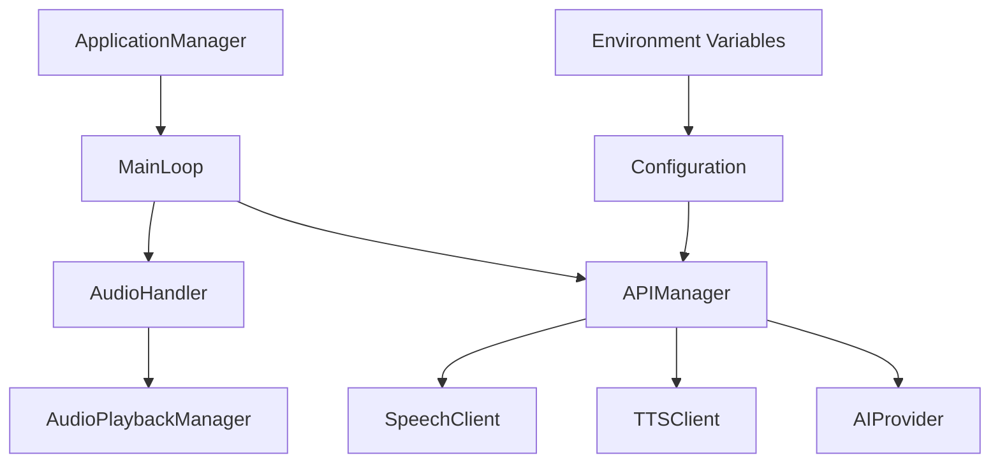

# Leadership & EQ Coach

[](https://www.python.org/downloads/)
[](LICENSE)
[](docs/plans/technical_roadmap.md)
[](#)

> **🎯 AI-powered leadership coaching device providing instant, personalized guidance through natural voice interaction**

Hold the spacebar, speak your leadership challenge, and receive immediate AI-powered coaching feedback through high-quality audio responses.

## 📑 Quick Links

- **🚀 [Quick Start](#-quick-start)** - Get running in 5 minutes
- **📋 [Spec-Driven Development](docs/settings/spec_driven_prompt.md)** - Development workflow and AI assistant configuration
- **🛠️ [Bootstrap Guide](docs/settings/bootstrap_py.md)** - Complete development environment setup
- **📊 [Technical Roadmap](docs/plans/technical_roadmap.md)** - Development phases and milestones
- **🎯 [Product Roadmap](docs/plans/product_roadmap.md)** - Feature roadmap and vision

---

## 📋 Table of Contents

- [🚀 Quick Start](#-quick-start)
- [📖 Project Overview](#-project-overview)
- [🏗️ Architecture](#️-architecture)
- [💻 Installation](#-installation)
- [⚙️ Configuration](#️-configuration)
- [🎮 Usage](#-usage)
- [📚 API Reference](#-api-reference)
- [🧪 Development](#-development)
- [🔧 Testing](#-testing)
- [📁 Project Structure](#-project-structure)
- [🚀 Deployment](#-deployment)
- [🔍 Troubleshooting](#-troubleshooting)
- [🤝 Contributing](#-contributing)
- [🔒 Security](#-security)
- [📄 License](#-license)
- [❓ FAQ](#-faq)
- [📞 Support](#-support)

---

## 🚀 Quick Start

### Prerequisites

- **Python 3.9+** (3.9.6+ recommended)
- **Google Cloud account** with billing enabled
- **Microphone and speakers/headphones**
- **Git** for version control

### 5-Minute Setup

```bash
# 1. Clone and enter the repository
git clone https://github.com/your-username/leadershipbutton.git
cd leadershipbutton

# 2. Install dependencies
pip install -r requirements.txt

# 3. Set up environment variables
cp env.example .env
# Edit .env with your Google Cloud credentials (see Configuration section)

# 4. Enable Google Cloud APIs
gcloud services enable speech.googleapis.com
gcloud services enable texttospeech.googleapis.com

# 5. Start the application
python3 src/main.py

# 6. Use the application
# • Hold SPACEBAR to record your leadership question
# • Release to process and hear the AI response
```

<<<<<<< Updated upstream 4. **Configure the spec-driven workflow:**

- Open `docs/settings/spec_driven_prompt.md`
- Copy the entire contents
- In Cursor, open your "Spec-Driven Python" custom mode
- Paste the contents into the "Instructions" box

5. **Start the application:**

   ```bash
   python src/main.py
   ```

6. **Use the application:**
   - Hold the spacebar to record your leadership question
   - Release to process and hear the AI response
   - # Continue the conversation with follow-up questions

---

> > > > > > > Stashed changes

## 📖 Project Overview

The Leadership & EQ Coach is a comprehensive AI-powered system that combines:

### 🎯 Core Features

- **🎤 Voice-First Interface**: Natural hold-to-record interaction using spacebar
- **🧠 AI Integration**: Powered by Google Cloud Speech & Text-to-Speech APIs
- **🔒 Secure Credential Management**: Environment-based configuration
- **🎛️ Multi-Environment Support**: Development, production configurations
- **📊 Robust Architecture**: Centralized, testable, maintainable design
- **🔧 Comprehensive Testing**: 100% component coverage with deep validation

### 📈 Current Status

- ✅ **Phase 1 Complete**: Core functionality, testing framework, documentation
- ✅ **Production Ready**: All systems operational, security measures in place
- 🔄 **Phase 2 Planned**: Advanced AI integration, conversational features
- 📋 **Phase 3 Planned**: Hardware integration (Raspberry Pi)
- 📋 **Phase 4 Planned**: Enterprise deployment

---

## 🏗️ Architecture

### Core Components



### 🧩 Key Classes

| Component              | Purpose                  | Key Features                                                |
| ---------------------- | ------------------------ | ----------------------------------------------------------- |
| **MainLoop**           | Application orchestrator | State management, spacebar detection, workflow coordination |
| **APIManager**         | Google Cloud interface   | Speech-to-text, text-to-speech, credential management       |
| **AudioHandler**       | Audio processing         | Recording, playback, device management                      |
| **ApplicationManager** | Entry point management   | CLI handling, logging, lifecycle management                 |

---

## 💻 Installation

### System Requirements

- **Operating System**: macOS, Linux, Windows
- **Python**: 3.9+ (3.9.6+ recommended)
- **Memory**: 512MB RAM minimum
- **Storage**: 100MB available space
- **Network**: Internet connection for Google Cloud APIs

### Detailed Installation

1. **Clone the Repository**

   ```bash
   git clone https://github.com/your-username/leadershipbutton.git
   cd leadershipbutton
   ```

2. **Create Virtual Environment** (Recommended)

   ```bash
   python3 -m venv venv
   source venv/bin/activate  # On Windows: venv\Scripts\activate
   ```

3. **Install Dependencies**

   ```bash
   pip install -r requirements.txt
   ```

4. **Verify Installation**
   ```bash
   python3 -c "import leadership_button; print('✅ Installation successful')"
   ```

---

## ⚙️ Configuration

### Environment Variables Setup

1. **Copy Environment Template**

   ```bash
   cp env.example .env
   ```

2. **Google Cloud Setup**

   **Option A: Service Account File**

   ```bash
   # Download service account JSON from Google Cloud Console
   # Place in project root as service-account.json
   ```

   **Option B: Environment Variables** (Recommended)

   ```bash
   # Edit .env file with individual credentials
   GOOGLE_CLOUD_PROJECT=your-project-id
   GOOGLE_CLOUD_TYPE=service_account
   GOOGLE_CLOUD_PRIVATE_KEY_ID=your-private-key-id
   # ... (see env.example for complete list)
   ```

3. **Enable Required APIs**
   ```bash
   gcloud services enable speech.googleapis.com
   gcloud services enable texttospeech.googleapis.com
   ```

### Configuration Files

| File                                 | Purpose                  | Environment      |
| ------------------------------------ | ------------------------ | ---------------- |
| `config/api_config.json`             | Main configuration       | All environments |
| `config/api_config.development.json` | Development overrides    | Development only |
| `config/api_config.production.json`  | Production optimizations | Production only  |

### Required Environment Variables

| Variable                    | Description                 | Required |
| --------------------------- | --------------------------- | -------- |
| `GOOGLE_CLOUD_PROJECT`      | Google Cloud project ID     | Yes      |
| `GOOGLE_CLOUD_TYPE`         | Service account type        | Yes      |
| `GOOGLE_CLOUD_PRIVATE_KEY`  | Service account private key | Yes      |
| `GOOGLE_CLOUD_CLIENT_EMAIL` | Service account email       | Yes      |

---

## 🎮 Usage

### Command Line Interface

```bash
# Start in development mode (default)
python3 src/main.py

# Start in production mode
python3 src/main.py --mode production

# Use custom configuration
python3 src/main.py --config custom_config.json

# Record audio to file for testing
python3 src/main.py --record test_audio.wav

# Show application status
python3 src/main.py --status

# Run tests
python3 src/main.py --test

# Show version
python3 src/main.py --version

# Show help
python3 src/main.py --help
```

### Interactive Usage

1. **Start the Application**

   ```bash
   python3 src/main.py
   ```

2. **Voice Interaction**
   - **Hold SPACEBAR** to start recording
   - **Speak clearly** into your microphone
   - **Release SPACEBAR** when finished speaking
   - **Listen** to the AI response

3. **Application States**
   - `IDLE`: Ready for recording
   - `RECORDING`: Currently recording audio
   - `PROCESSING`: Processing speech and generating response
   - `SPEAKING`: Playing back AI response
   - `ERROR`: Error state (see logs for details)

### Example Interactions

```
🎤 HOLD THE SPACEBAR TO RECORD

User: "How do I handle a difficult team member who's not meeting deadlines?"
AI: "Here are three effective strategies for addressing performance issues..."

User: "What's the best way to give constructive feedback?"
AI: "Effective feedback follows the SBI model: Situation, Behavior, Impact..."
```

---

## 📚 API Reference

### Core Classes

#### MainLoop

```python
from leadership_button.main_loop import MainLoop

# Initialize main application loop
main_loop = MainLoop(config_path="config/api_config.json")

# Start the application (blocking)
main_loop.start()

# Get current application state
state = main_loop.get_state()  # Returns ApplicationState enum

# Stop the application
main_loop.stop()
```

#### APIManager

```python
from leadership_button.api_client import APIManager, APIConfig

# Initialize API manager
config = APIConfig("config/api_config.json")
api_manager = APIManager(config)

# Speech-to-text
text = api_manager.speech_to_text(audio_data)

# Text-to-speech
audio_data = api_manager.text_to_speech("Hello, world!")

# Check API status
is_ready = api_manager.state == APIState.READY
```

#### AudioHandler

```python
from leadership_button.audio_handler import AudioHandler, AudioConfig

# Initialize audio handler
config = AudioConfig()
audio_handler = AudioHandler(config)

# Record audio
audio_handler.start_recording()
# ... user speaks ...
audio_data = audio_handler.stop_recording()

# Play audio
audio_handler.play_audio(audio_data)
```

#### ApplicationManager

```python
from main import ApplicationManager

# Initialize application manager
app_manager = ApplicationManager()

# Set up logging
app_manager.setup_logging("development")

# Show status
app_manager.show_status()

# Record audio to file
app_manager.record_audio_to_file("test.wav")
```

### Configuration Classes

#### APIConfig

```python
from leadership_button.api_client import APIConfig

# Load configuration
config = APIConfig("config/api_config.json")

# Access configuration sections
api_settings = config.api_settings
google_cloud = config.google_cloud
audio_settings = config.audio_settings
```

#### AudioConfig

```python
from leadership_button.audio_handler import AudioConfig

# Create audio configuration
config = AudioConfig(
    sample_rate=16000,
    channels=1,
    chunk_size=1024
)
```

### Utility Functions

```python
# Create Google Cloud credentials from environment
from leadership_button.api_client import create_google_cloud_credentials
credentials = create_google_cloud_credentials()

# Audio playback utilities
from leadership_button.audio_playback import play_audio, play_audio_and_wait
play_audio(audio_data)
play_audio_and_wait(audio_data)
```

---

## 🧪 Development

### Development Workflow

This project uses **Spec-Driven Development**. See [docs/settings/spec_driven_prompt.md](docs/settings/spec_driven_prompt.md) for complete workflow setup.

#### Bootstrap Development Environment

1. **Configure AI Assistant**

   ```bash
   # Copy spec-driven prompt to your AI assistant
   cat docs/settings/spec_driven_prompt.md
   # Paste into Cursor "Spec-Driven Python" custom mode
   ```

2. **Set Development Mode**

   ```bash
   python3 src/main.py --mode development
   ```

3. **Enable Debug Features**
   - Development config automatically enables:
     - DEBUG level logging
     - Audio file saving
     - Verbose output
     - Extended speech alternatives

### Code Style and Standards

- **Linting**: `flake8` for code quality
- **Formatting**: `black` for consistent code style
- **Pre-commit**: Automatic code quality checks
- **Type Hints**: Comprehensive type annotations
- **Documentation**: Docstrings for all public methods

### Development Commands

```bash
# Run with development config
python3 src/main.py --mode development

# Enable debug audio saving
export SAVE_DEBUG_AUDIO=true

# Run with verbose logging
export VERBOSE_LOGGING=true

# Use mock API calls for testing
export MOCK_API_CALLS=true
```

---

## 🔧 Testing

### Test Suite Overview

The project includes comprehensive testing with 100% component coverage:

- **Unit Tests**: Individual component testing
- **Integration Tests**: Component interaction testing
- **Deep Check Mode**: Comprehensive system validation
- **User Integration Tests**: End-to-end workflow testing

### Running Tests

```bash
# Run all tests
python3 src/main.py --test

# Run deep system check
python3 -c "
import sys; sys.path.append('src')
# Deep check code available in codebase
"

# Run specific test categories
python3 -m pytest tests/test_api_client.py
python3 -m pytest tests/test_audio_handler.py
python3 -m pytest tests/test_main_loop.py
```

### Test Configuration

Tests use centralized methods to avoid business logic duplication:

- **No test code in main files** (strict enforcement)
- **Centralized test orchestration** through MainLoop
- **Mock LLM provider** for testing without AI costs
- **Real component testing** (no mocking without consent)

### Deep Check Mode

Comprehensive system validation covering:

1. **System Dependencies & Environment**
2. **Configuration Files & Project Structure**
3. **Security & Credential Validation**
4. **Component Integration & Error Handling**
5. **Advanced Functionality & Edge Cases**

---

## 📁 Project Structure

```
leadershipbutton/
├── 📁 src/                          # Source code
│   ├── main.py                      # Application entry point
│   └── leadership_button/           # Main package
│       ├── __init__.py              # Package initialization
│       ├── main_loop.py             # Application orchestrator
│       ├── api_client.py            # Google Cloud API interface
│       ├── audio_handler.py         # Audio recording/playback
│       └── audio_playback.py        # Audio playback utilities
├── 📁 config/                       # Configuration files
│   ├── api_config.json              # Main configuration
│   ├── api_config.development.json  # Development overrides
│   └── api_config.production.json   # Production optimizations
├── 📁 docs/                         # Documentation
│   ├── plans/                       # Project planning
│   │   ├── technical_roadmap.md     # Technical milestones
│   │   └── product_roadmap.md       # Product vision
│   └── settings/                    # Development settings
│       ├── spec_driven_prompt.md    # AI assistant configuration
│       └── bootstrap_py.md          # Environment setup guide
├── 📁 tests/                        # Test suite
│   ├── test_api_client.py           # API client tests
│   ├── test_audio_handler.py        # Audio handler tests
│   └── test_main_loop.py            # Main loop tests
├── 📁 logs/                         # Application logs
├── .env                             # Environment variables (gitignored)
├── env.example                      # Environment template
├── requirements.txt                 # Python dependencies
├── .gitignore                       # Git ignore rules
├── .pre-commit-config.yaml          # Code quality hooks
└── README.md                        # This file
```

### Key Files Description

| File/Directory                           | Purpose                                            |
| ---------------------------------------- | -------------------------------------------------- |
| `src/main.py`                            | Application entry point and CLI interface          |
| `src/leadership_button/main_loop.py`     | Core application orchestrator and state management |
| `src/leadership_button/api_client.py`    | Google Cloud Speech/TTS API integration            |
| `src/leadership_button/audio_handler.py` | Audio recording, playback, and device management   |
| `config/api_config.json`                 | Main application configuration                     |
| `docs/settings/spec_driven_prompt.md`    | AI assistant development workflow                  |
| `.env`                                   | Environment variables and secrets (not in git)     |
| `env.example`                            | Template for environment setup                     |

---

## 🚀 Deployment

### Production Deployment

1. **Environment Setup**

   ```bash
   # Use production configuration
   python3 src/main.py --mode production --config config/api_config.production.json
   ```

2. **Production Features**
   - Optimized performance settings
   - Caching enabled (1-hour duration)
   - Voice activity detection
   - Noise reduction
   - Minimal logging (INFO level)

3. **Monitoring**

   ```bash
   # Check application status
   python3 src/main.py --status

   # Monitor logs
   tail -f logs/application.log
   ```

### Docker Deployment

```dockerfile
# Dockerfile (not yet implemented)
FROM python:3.9-slim
WORKDIR /app
COPY requirements.txt .
RUN pip install -r requirements.txt
COPY src/ ./src/
COPY config/ ./config/
CMD ["python3", "src/main.py", "--mode", "production"]
```

### Environment Variables for Production

```bash
# Production .env
GOOGLE_CLOUD_PROJECT=your-production-project
ENVIRONMENT=production
LOG_LEVEL=INFO
VERBOSE_LOGGING=false
SAVE_DEBUG_AUDIO=false
```

---

## 🔍 Troubleshooting

### Common Issues

#### Audio Issues

**Problem**: No audio input/output detected

```bash
# Check audio devices
python3 -c "import pyaudio; print(pyaudio.PyAudio().get_device_count())"

# Test audio recording
python3 src/main.py --record test.wav
```

**Problem**: Poor audio quality

- Check microphone settings
- Adjust `AUDIO_SAMPLE_RATE` in .env
- Ensure quiet environment

#### API Issues

**Problem**: Google Cloud authentication failed

```bash
# Verify environment variables
python3 -c "
from dotenv import load_dotenv
import os
load_dotenv()
print('Project:', os.getenv('GOOGLE_CLOUD_PROJECT'))
print('Email:', os.getenv('GOOGLE_CLOUD_CLIENT_EMAIL'))
"

# Test credential creation
python3 -c "
import sys; sys.path.append('src')
from leadership_button.api_client import create_google_cloud_credentials
creds = create_google_cloud_credentials()
print('Credentials:', 'Working' if creds else 'Failed')
"
```

**Problem**: API quota exceeded

- Check Google Cloud Console quotas
- Implement request throttling
- Consider upgrading API limits

#### Application Issues

**Problem**: Spacebar not responding

- Check terminal focus
- Verify raw input mode
- Try different terminal emulator

**Problem**: Application crashes on startup

```bash
# Check configuration
python3 -c "
import sys; sys.path.append('src')
from leadership_button.api_client import APIConfig
config = APIConfig('config/api_config.json')
print('Config loaded successfully')
"

# Check deep system validation
python3 src/main.py --test
```

### Debug Mode

Enable comprehensive debugging:

```bash
# Set debug environment
export LOG_LEVEL=DEBUG
export VERBOSE_LOGGING=true
export SAVE_DEBUG_AUDIO=true

# Run with development config
python3 src/main.py --mode development
```

### Log Analysis

```bash
# View recent logs
tail -n 100 logs/application.log

# Search for errors
grep -i error logs/application.log

# Monitor live logs
tail -f logs/application.log
```

---

## 🤝 Contributing

### Contributing Guidelines

1. **Fork the Repository**
2. **Create Feature Branch**: `git checkout -b feature/amazing-feature`
3. **Follow Spec-Driven Development**: See [docs/settings/spec_driven_prompt.md](docs/settings/spec_driven_prompt.md)
4. **Write Tests**: Maintain 100% component coverage
5. **Update Documentation**: Keep README and specs current
6. **Submit Pull Request**: Include comprehensive description

### Development Standards

- **Code Quality**: All code must pass `flake8` and `black` formatting
- **Testing**: No business logic in tests, use centralized methods
- **Documentation**: Update all relevant documentation
- **Security**: No secrets in code, use environment variables

### Pull Request Process

1. Ensure all tests pass
2. Update README.md if needed
3. Add entry to CHANGELOG.md
4. Request review from maintainers

---

## 🔒 Security

### Security Measures

- ✅ **Secrets Management**: All credentials in environment variables
- ✅ **Git Security**: Comprehensive .gitignore for sensitive files
- ✅ **Input Validation**: Sanitized audio and text processing
- ✅ **API Security**: Proper authentication and authorization

### Security Best Practices

1. **Never commit secrets** to version control
2. **Use environment variables** for all credentials
3. **Regularly rotate** API keys and credentials
4. **Monitor API usage** for unexpected activity
5. **Keep dependencies updated** for security patches

### Reporting Security Issues

Please report security vulnerabilities to: security@yourproject.com

---

## 📄 License

This project is licensed under the MIT License - see the [LICENSE](LICENSE) file for details.

### Third-Party Licenses

- **Google Cloud Libraries**: Apache 2.0 License
- **PyAudio**: MIT License
- **Python-dotenv**: BSD License

---

## ❓ FAQ

**Q: What Python versions are supported?**
A: Python 3.9+ is required. Python 3.9.6+ is recommended for best compatibility.

**Q: Can I use this without Google Cloud?**
A: Currently, Google Cloud Speech and Text-to-Speech APIs are required. Support for alternative providers is planned for Phase 2.

**Q: How much does it cost to run?**
A: Costs depend on Google Cloud API usage. Typical usage: ~$0.01-0.05 per minute of audio processing.

**Q: Can I run this on Raspberry Pi?**
A: Raspberry Pi support is planned for Phase 3. Current version requires standard desktop/laptop hardware.

**Q: Is offline mode available?**
A: Not currently. Offline speech processing is planned for future versions.

**Q: How do I add custom AI responses?**
A: AI integration is planned for Phase 2. Currently uses mock responses for testing.

---

## 📞 Support

### Getting Help

- **📖 Documentation**: Check this README and [docs/](docs/) directory
- **🐛 Issues**: [GitHub Issues](https://github.com/your-username/leadershipbutton/issues)
- **💬 Discussions**: [GitHub Discussions](https://github.com/your-username/leadershipbutton/discussions)
- **📧 Email**: support@yourproject.com

### Community

- **Discord**: [Join our Discord](https://discord.gg/yourproject)
- **Twitter**: [@YourProject](https://twitter.com/yourproject)
- **Blog**: [project-blog.com](https://project-blog.com)

---

## 🙏 Acknowledgments

- **Google Cloud Platform** for Speech and Text-to-Speech APIs
- **Python Community** for excellent libraries and tools
- **Open Source Contributors** who make projects like this possible

---

**Made with ❤️ by the Leadership & EQ Coach Team**

---

_Last updated: 2025-01-03 | Version: 1.0 | Status: Production Ready_
