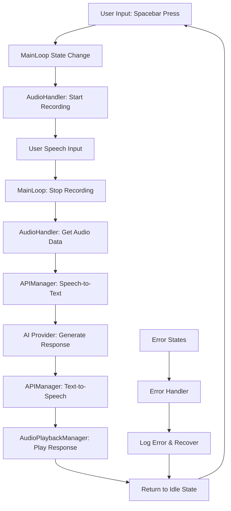
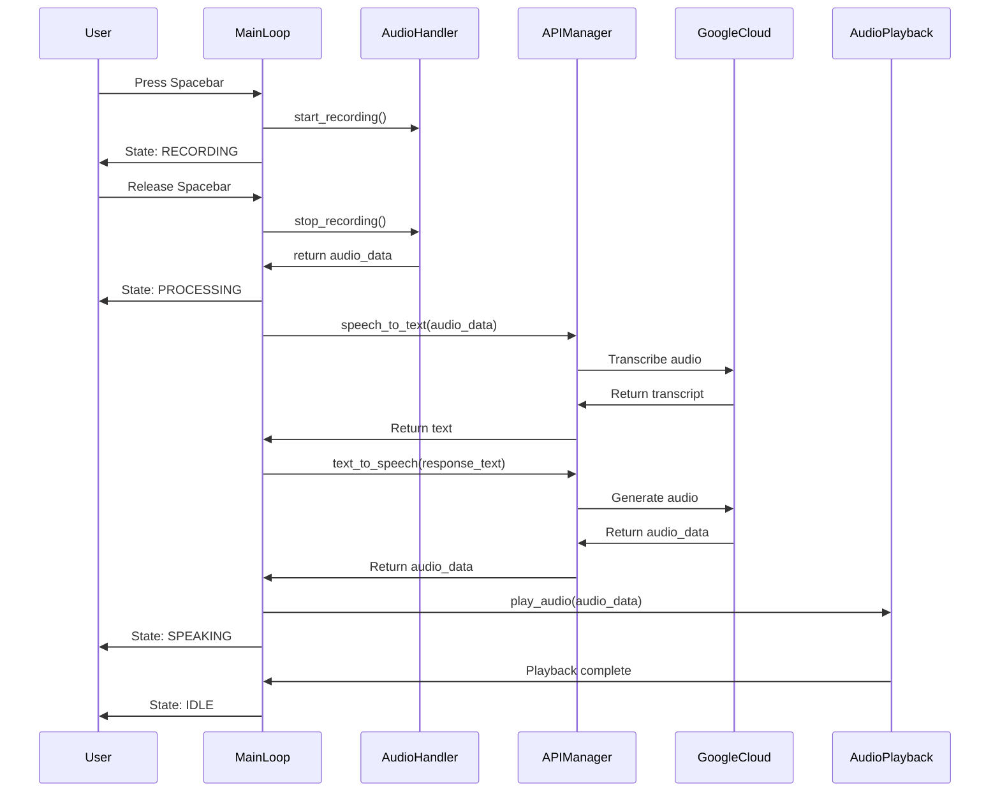
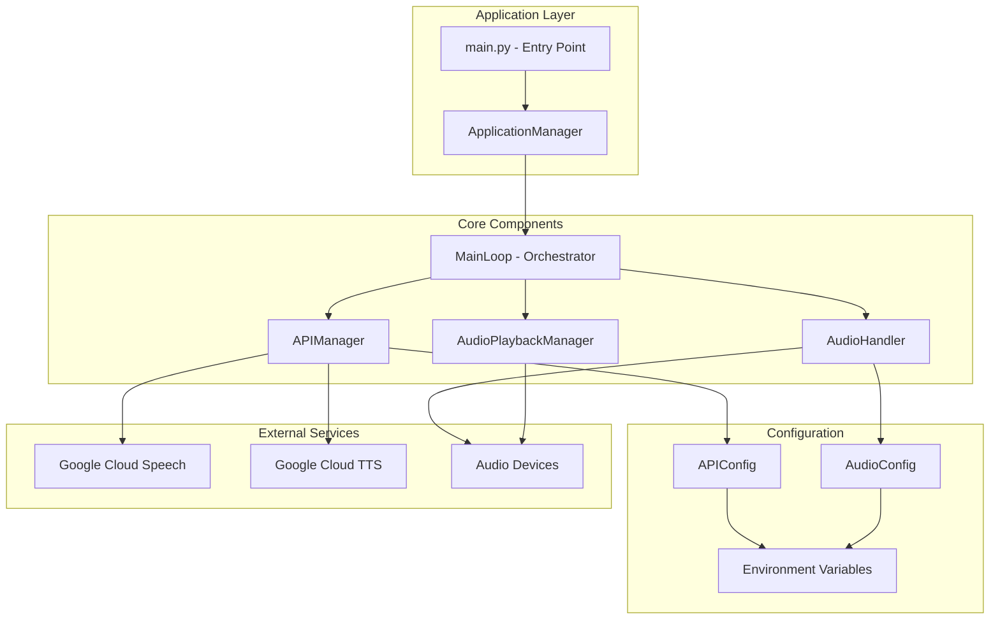

# Project Architecture

## 1. Core Principles

### Security

- All user credentials managed through environment variables
- No secrets stored in code or version control
- Google Cloud credentials secured via service account authentication
- **All private keys must be stored in .env file** - API keys, authentication tokens, and sensitive credentials shall be managed exclusively through environment variables loaded from .env files

### Performance

- Audio processing optimized for real-time interaction
- API responses targeted under 2 seconds for user experience
- Efficient state management with minimal memory overhead

### Maintainability

- Spec-driven development with clear documentation trail
- Modular component architecture with defined interfaces
- Comprehensive testing framework ensuring 100% component coverage

### Reliability

- Robust error handling with graceful degradation
- State recovery mechanisms for interrupted operations
- Input validation and sanitization throughout the pipeline

### Extensibility

- Abstract interfaces designed for future hardware integration
- Plugin architecture prepared for multiple AI providers
- Configuration-driven behavior for environment flexibility

## 2. System Overview

The Leadership Button is a voice-first AI coaching system built on a modular, event-driven architecture. The system orchestrates real-time audio capture, speech processing, AI interaction, and audio playback through a centralized state machine.

**Core Workflow:**

1. User input detection (spacebar/button press)
2. Audio recording and capture
3. Speech-to-text conversion via Google Cloud
4. AI processing and response generation
5. Text-to-speech conversion
6. Audio playback to user

**Key Components:**

- **MainLoop**: Central orchestrator managing application state and workflow
- **AudioHandler**: Real-time audio recording and device management
- **APIManager**: Google Cloud service integration and credential management
- **AudioPlaybackManager**: Centralized audio output with queue management

## 3. Component Diagrams

### 3.1. High-Level Flowchart

### 3.2. Sequence Diagram

### 3.3. Component Architecture

## 4. Approved Architectural Deviations Log

Current development phase allows the following temporary deviations for rapid prototyping:

| Task                | Rule Violated                                 | Rationale                                                          | Resolution Phase                                  |
| :------------------ | :-------------------------------------------- | :----------------------------------------------------------------- | :------------------------------------------------ |
| Mock AI Provider    | "No mocking without consent" testing rule     | Phase 1 focuses on audio pipeline; AI integration comes in Phase 2 | Phase 2: Replace with real Gemini integration     |
| Spacebar-only Input | Extensibility principle - single input method | Phase 1 proof of concept; hardware abstraction planned             | Phase 3: Abstract input layer with button support |
| Single-user Mode    | Multi-user extensibility                      | Phase 1 core functionality; multi-user features planned            | Phase 2: User management and personalization      |
| Development Logging | Production performance principle              | Enhanced debugging during active development                       | Phase 4: Production-optimized logging levels      |

## 4. Audio Helper Scripts Architecture

### 4.1 Kit.txt Integration (Phase 3)

This section defines the architecture for integrating Mixkit `kit.txt` metadata into the audio helper scripts system.

#### Components

- `KitProcessor` (module: `helpers/soundscripts/kit_processor.py`)
  - Parses `kit.txt` files (pipe-delimited)
  - Validates and normalizes entries (`filename`, `title`, `category`, `duration`, `tags`, `description`)
  - Exposes APIs for parsing, validation, and exporting kit data
- `KitEntry` (dataclass)
  - Represents a single `kit.txt` entry with validation-ready fields
- `CSVManager` (module: `helpers/soundscripts/csv_manager.py`) [Enhanced]
  - Adds support for new columns: `kit_title`, `kit_category`, `kit_tags`, `kit_description`
  - Merges kit metadata into existing rows by filename matching
- `Main Orchestrator` (module: `helpers/soundscripts/main.py`) [Enhanced]
  - Coordinates end-to-end workflow
  - Invokes `KitProcessor` at the appropriate stage (pre- or post-analysis as configured)
- `Config` (module: `helpers/soundscripts/config.py`) [Enhanced]
  - Adds `KIT_FILE_PATHS` and `KIT_PROCESSING_CONFIG`
- `Logging`
  - Reuses centralized logging via `helpers/soundscripts/utils.py`

#### Responsibilities & Interfaces

- `KitProcessor.parse_kit_file(path: str) -> List[KitEntry]`
- `KitProcessor.validate_kit_entry(entry: KitEntry) -> bool`
- `KitProcessor.parse_duration(duration: str) -> float`
- `CSVManager.add_kit_columns()`
- `CSVManager.merge_kit_data(kit_entries: List[KitEntry])`
- `MainOrchestrator.run(enable_kit_integration: bool)` ensures deterministic ordering and idempotent merging

#### Data Model

- `kit.txt` line format: `filename|title|category|duration|tags|description`
- Duration formats supported: `SS(.sss)`, `MM:SS`, `HH:MM:SS`
- CSV new columns: `kit_title`, `kit_category`, `kit_tags`, `kit_description`

#### Control Flow (Pre-Processing Variant)

1. Main orchestrator loads config and initializes logging
2. If `enable_kit_integration` is true and `kit.txt` present:
   - `KitProcessor.parse_kit_file()` -> `List[KitEntry]`
   - Filter by `validate_kit_entry()`
3. `CSVManager.add_kit_columns()` (no-op if present)
4. `CSVManager.merge_kit_data(valid_kit_entries)`
5. Proceed with directory scanning, analysis, and URL generation

#### Control Flow (Post-Processing Variant)

1. Run analysis and generate base CSV
2. If `enable_kit_integration` is true:
   - Parse and validate kit entries
   - Merge kit data into existing CSV
3. Backup CSV with timestamp

#### Matching Strategy

- Primary: exact filename match (case-insensitive, extension-aware)
- Secondary: normalize names (strip extension, whitespace); try extension substitution
- Tertiary: configurable partial match with confidence threshold
- Conflicts: preserve existing core analysis fields; prefer kit data for title/category/tags/description (configurable)

#### Error Handling & Resilience

- Missing `kit.txt`: log warning and continue without kit data
- Malformed lines: log with line number; skip entry
- Validation failures: tracked in stats; exclude from merge
- Backup: include kit-enriched CSV in existing backup rotation
- Resume: merging is idempotent; safe to re-run

#### Observability

- Metrics: match rate, validation success, merge count, conflicts, processing duration
- Logs: per-line parse errors, validation issues, merge decisions (at debug level)

#### Security & Compliance

- No secrets required; follows project rule to keep credentials in `.env` for other components
- Input sanitization on all text fields

#### Extensibility

- Multiple `kit.txt` sources supported via `KIT_FILE_PATHS`
- Hook for AI enrichment of metadata in future phases
